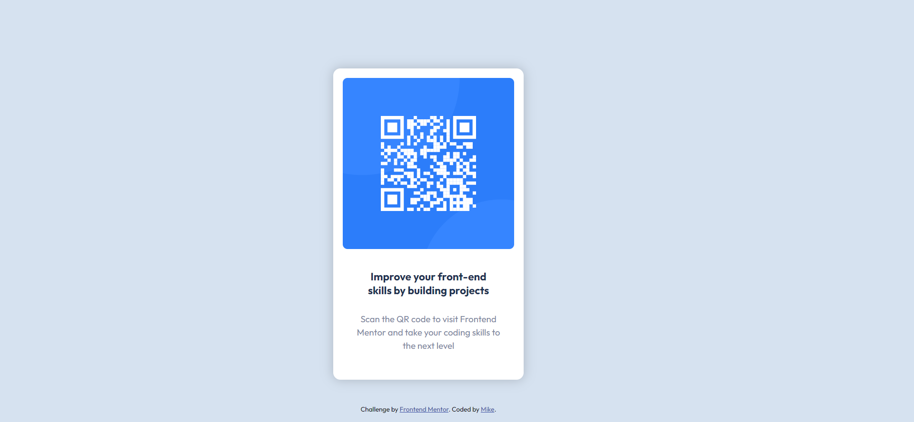

# Frontend Mentor - QR code component solution

This is a solution to the [QR code component challenge on Frontend Mentor](https://www.frontendmentor.io/challenges/qr-code-component-iux_sIO_H). Frontend Mentor challenges help you improve your coding skills by building realistic projects. 

## Table of contents

- [Overview](#overview)
  - [Screenshot](#screenshot)
  - [Links](#links)
- [My process](#my-process)
  - [Built with](#built-with)
  - [What I learned](#what-i-learned)
  - [Useful resources](#useful-resources)
- [Author](#author)
- [Acknowledgments](#acknowledgments)


## Overview
I've successfully designed the front-end of a QR code card using HTML and CSS. The card features a visually appealing layout achieved through effective styling and positioning. The use of CSS has allowed for precise control over elements, ensuring a polished and professional appearance. 
### Screenshot




### Links

- Solution URL: [My solution URL here](https://github.com/sanyomor-01/qr-code-component-main/settings)
- Live Site URL: [Live site URL here](https://qr-code-component-main-tau-red.vercel.app/)

## My process

First, I started with the structure, that's the html part .
And continued with the styling
### Built with

- Semantic HTML5 markup
- CSS custom properties
- Flexbox
- CSS Grid
- Mobile-first workflow

### What I learned
I learn to use of css flex to arrange elements and going forward I will be experimenting it.
Also I used to center elements by writing more css codes, with the display grid property it was easy.
This is the code  

```html
<main class="container">
  <div class= "sub-container">
     <h1>Awesome work keep it up</h1>
  </div>
</main>
```
```css
.container {
  display: grid;
  place-item: center;
  height: 100vh;
}

.sub-container{
  width: 100px;
  height: 100px
}
```


### Useful resources

- [MDN web docs](https://developer.mozilla.org/en-US/docs/Web/CSS/box-shadow) - This helped me for adding the box shadow. I really liked this pattern and will use it going forward.


## Acknowledgments
Thanks to me for doing a great job.

